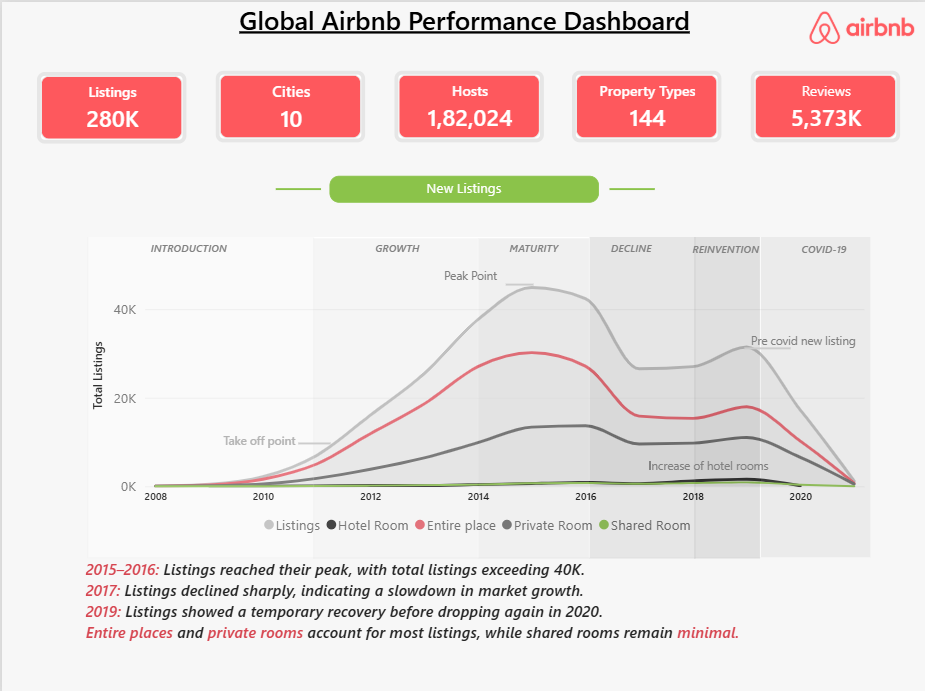
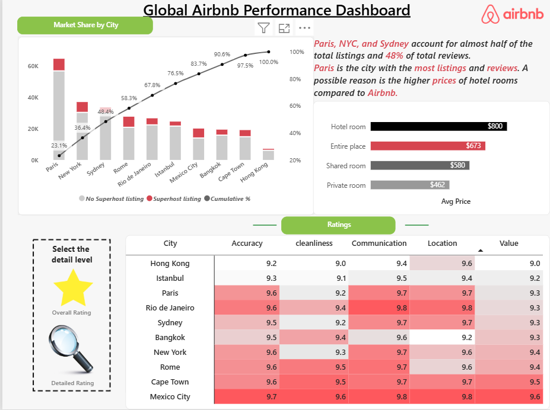
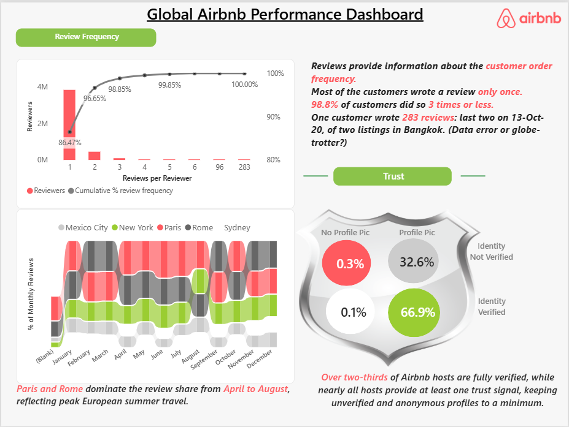

# 🏠 Global Airbnb Performance Dashboard

An interactive **Power BI dashboard** designed to analyze Airbnb listings, reviews, hosts, property types, pricing, ratings, and market trends across major cities.

The dashboard provides a business-focused view of Airbnb performance using data visualization, DAX measures, and interactive analytics.

---

## 📊 Dashboard Pages

### 1. New Listings
- Total Listings
- Total Cities
- Total Hosts
- Property Types
- Total Reviews
- Listing growth and lifecycle analysis
- Listing trends by property type

### 2. Market Share & Ratings
- Market share by city
- Cumulative percentage analysis
- Superhost vs. non-superhost listings
- Average price by room type
- City-level rating comparison
- Accuracy, cleanliness, communication, location and value ratings

### 3. Review Frequency & Trust
- Reviews per reviewer analysis
- Cumulative review frequency
- Monthly review seasonality
- Host verification analysis
- Profile picture and identity verification analysis

---

## 🔑 Key KPIs

| KPI | Value |
|---|---:|
| Listings | 280K |
| Cities | 10 |
| Hosts | 182,024 |
| Property Types | 144 |
| Reviews | 5.373M |

---

## 🛠️ Tools & Technologies

- **Microsoft Power BI**
- **DAX**
- **Power Query**
- **Data Modeling**
- **Data Visualization**
- **Interactive Filters & Slicers**

---

## 📈 Key Insights

- Paris, New York City and Sydney account for a significant share of Airbnb listings and reviews.
- Most customers/reviewers posted reviews only once.
- Approximately **98.8% of reviewers submitted 3 reviews or fewer**.
- Paris and Rome dominate review share during the April–August period.
- More than two-thirds of Airbnb hosts are fully verified.
- Entire places and private rooms account for most listings.
- Shared rooms represent a relatively small portion of the market.
- Listing growth peaked around 2015–2016 before declining in later years.

---

## 📷 Dashboard Screenshots

### Overview

### Ratings

### Reviews

---

## 🎯 Project Objectives

The objective of this project is to transform Airbnb data into meaningful business insights by analyzing:

- Market performance
- Listing growth
- Customer review behavior
- Host trust and verification
- Pricing patterns
- Property types
- City-level performance
- Rating metrics
- Seasonal review trends

---

## 💡 Skills Demonstrated

- Data Cleaning
- Data Transformation
- Data Modeling
- DAX Measures
- KPI Development
- Power BI Dashboard Design
- Business Intelligence
- Data Analysis
- Data Storytelling
- Interactive Visualization

---
## Power BI Dashboard

The dashboard was developed using Microsoft Power BI Desktop.

Due to the large file size, the `.pbix` file is not included in this repository.
The repository contains dashboard screenshots, dataset files, and project documentation.

## 👩‍💻 Author

**Prarthana Jadhav**

Aspiring Data Analyst | Excel | SQL | Power BI | Python

---

⭐ If you find this project useful, feel free to explore the dashboard screenshots and repository.
